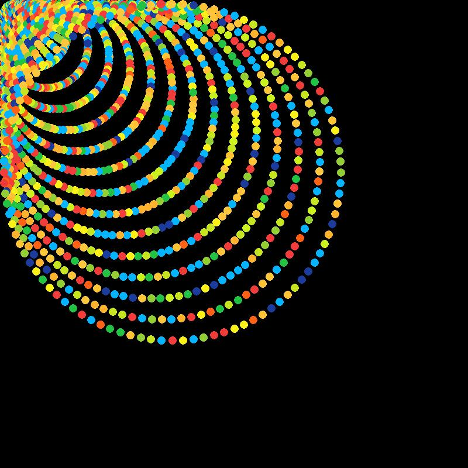
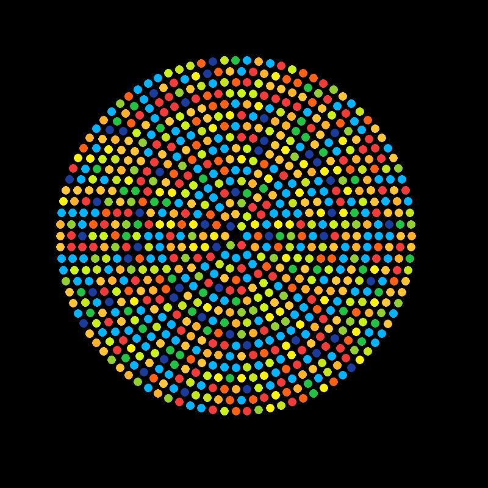

# π: Pi Math piImages

This Repository generate stunning images show the beauty hidden in pi using Python.

## Mathematics and Art

### Figure: Screenshots of Creative arts

| Black             |  White |
| -------------- | -------------- |
|   |   |
|   |   |
|   |   |
|   |   |
|   |   |
|   |   |
|   |   |
|   |   |

### Incomplete Figure

|             |  |
| -------------- | -------------- |
|   |   |
|   |   |
|   |   |
|   |   |

### Credits

Professor **Seyyed Ali Reza Ashrafi** was the one who encouraged me to generate more of these works.

https://en.wikipedia.org/wiki/Ali_Reza_Ashrafi

---------

# Max Base

My nickname is Max, Programming language developer, Full-stack programmer. I love computer scientists, researchers, and compilers.

## Asrez Team

A team includes some programmer, developer, designer, researcher(s) especially Max Base.

[Asrez Team](https://www.asrez.com/)

